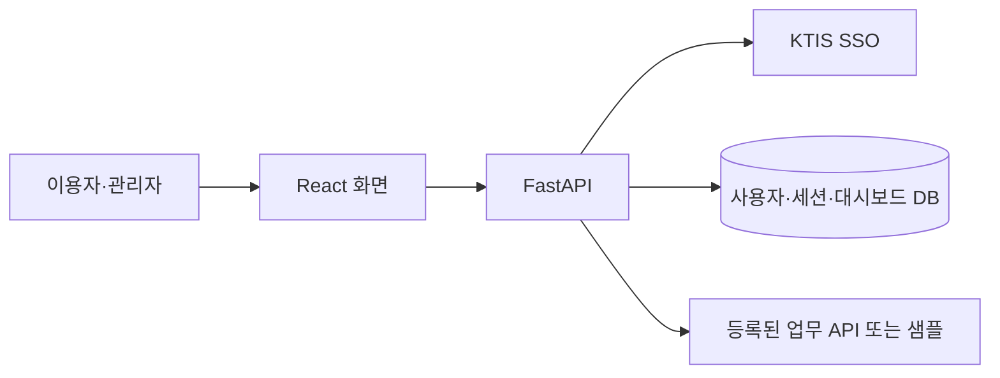

# 기술 스택과 시스템 구조

## 1. 기술 선택

| 영역 | 선택 | 목적 |
|---|---|---|
| 프론트엔드 | React + TypeScript + Vite | 조회 화면과 관리자 편집기 |
| 화면 컴포넌트 | Ant Design | 폼, 선택, 표, 모달, 상태 안내 |
| 화면 이동 | React Router | 이용자·관리자 경로 |
| 차트 | Apache ECharts | 첫 PoC의 막대 차트 |
| 상태 | React state/reducer + 공통 API 클라이언트 | 초안 편집과 요청 상태 |
| 백엔드 | Python + FastAPI + Pydantic | 인증, 설정 검증, 대시보드 API |
| DB 접근 | SQLAlchemy + Alembic | 저장과 스키마 변경 |
| DB | 로컬 SQLite / 공유 PoC PostgreSQL | 사용자·세션·대시보드 설정 |
| 외부 호출 | HTTPX | SSO 토큰 교환과 업무 API |
| 인증 | 기존 KTIS SSO + 서버 세션 | 사번 식별 |

React·FastAPI는 사용자 지정이며 나머지는 구현 기본안이다. 패키지 버전은 구현 시 호환성을 확인해 lock 파일에 고정한다. 별도 전역 상태 라이브러리는 초기에는 추가하지 않는다.

설계 참고: [React 상태 관리](https://react.dev/learn/managing-state), [Ant Design 컴포넌트](https://ant.design/components/overview/), [FastAPI 모듈 구성](https://fastapi.tiangolo.com/tutorial/bigger-applications/).

## 2. 요청 흐름



브라우저는 FastAPI만 호출한다. 관리자는 설정을 작성하고, 서버는 허용된 필드·지표인지 검증한다. 위젯별로 원천을 반복 조회하지 않고 동일 요청의 데이터는 한 번 읽어 여러 위젯 계산에 사용한다.

미리보기와 공개 조회는 동일한 검증·계산·렌더링 규칙을 공유한다. 공개 조회의 설정은 서버 공개본에서 가져오며 브라우저가 임의 위젯 정의를 보내 계산시키지 않는다.

## 3. 목표 폴더 구성

아래는 구현할 구조이며 현재 존재하는 파일 목록이 아니다.

```text
frontend/src/
├── app/                 # 라우팅, 세션, 공통 레이아웃
├── pages/               # 조회 목록·상세, 관리 목록·생성·편집
├── features/dashboard/  # 편집 reducer, 필터, 공통 렌더러
├── components/widgets/  # 카드·차트·표
└── api/                 # 요청, 401·403·409 등 공통 처리

backend/app/
├── auth/                # 기존 SSO·세션, 관리자 검사
├── dashboards/          # 라우터, 스키마, 저장·공개 서비스
├── data_sources/        # 등록 정보, 원천 조회, 지표 계산
├── models.py
├── db.py
├── config.py
└── main.py
backend/migrations/
```

기능별 모듈로 나누고 별도 gateway·plugin·workflow 서비스를 만들지 않는다. MCP와 자유 조인은 보류한다.

## 4. 프론트엔드 상태

세션은 앱 범위에서 관리하고, 편집 중 초안은 편집기 reducer에서 관리한다. 저장된 버전과 현재 변경 여부를 별도로 둔다.

조회 화면은 입력 중 필터와 적용된 필터를 구분한다. 요청 취소와 요청 식별자로 늦게 도착한 이전 결과를 무시한다. 표 페이지 데이터도 공개 버전이 바뀌면 폐기하고 최신 정의부터 다시 조회한다.

위젯 렌더러는 검증된 설정과 서버 계산 결과를 받아 표시만 한다. 금액·비율 등 업무 계산을 프론트엔드에서 다시 수행하지 않는다.

## 5. 개발·배포

개발 시 Vite에서 /api, /login, /sso/callback, /logout을 FastAPI로 프록시한다. SSO callback은 브라우저가 접근하는 출처로 등록한다.

공유 PoC는 React 빌드 파일을 정적 제공하고 인증·API 경로는 단일 FastAPI로 전달하는 동일 출처 구성을 사용한다. HTTPS 종료 지점과 신뢰 프록시는 배포 환경에서 정한다. API와 콜백이 SPA fallback에 잡히지 않도록 경로를 분리한다.

첫 버전은 요청 시 샘플 JSON 조회·수동 새로고침이다. 서버 캐시·백그라운드 갱신·Redis·작업 큐는 도입하지 않는다. 실제 업무 API 연결은 후속이며, 연결 시 시간·행 수 제한을 둔다.

개발 PC와 사내 서버에서 Docker Compose로 실행할 수 있어야 한다. 현재 `docker/compose.yaml`은 Spring/JDBC 환경변수와 사전 빌드 이미지를 사용하므로 FastAPI·React PoC에 그대로 사용할 수 없다. 구현 단계에서 프론트엔드·FastAPI 이미지 빌드, 정적 파일 제공, DB 연결, 샘플 파일 포함, SSO 환경변수와 callback 주소를 맞춘다. 공유 서버에서는 개발 자동 로그인을 끈다.

## 6. 구현 순서와 검증

| 단계 | 구현 | 확인 |
|---|---|---|
| 1 | SSO 연결, React 기본 레이아웃·세션 | 로그인·만료·로그아웃 |
| 2 | DB migration, 대시보드 CRUD·역할 검사 | 일반 사용자 차단, 초안 저장 |
| 3 | 재고 JSON 등록 소스·필드·지표와 조회 서비스 | 날짜별 행 수·제조사·모델 집계, 정상 0건·실패 구분 |
| 4 | 편집기, 위젯 설정, 공통 렌더러·미리보기 | 저장·재열기·배치·검증 오류 |
| 5 | 공개·중지, 이용자 목록·상세·필터 | 초안 비노출, 공개본 유지, 중지 후 차단 |
| 6 | Docker 실행·시연 검증 | 개발 PC·사내 서버 기동, 동시 저장 충돌, 세션 만료, 데이터 장애 |

핵심 테스트는 계산 단위 테스트, FastAPI의 권한·저장·공개 통합 테스트, 생성→편집→공개→이용자 조회 브라우저 시나리오다.
